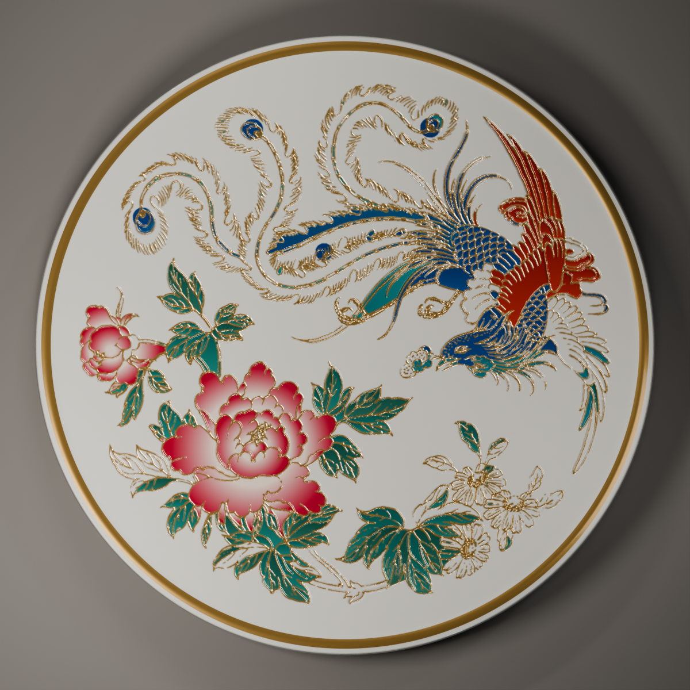
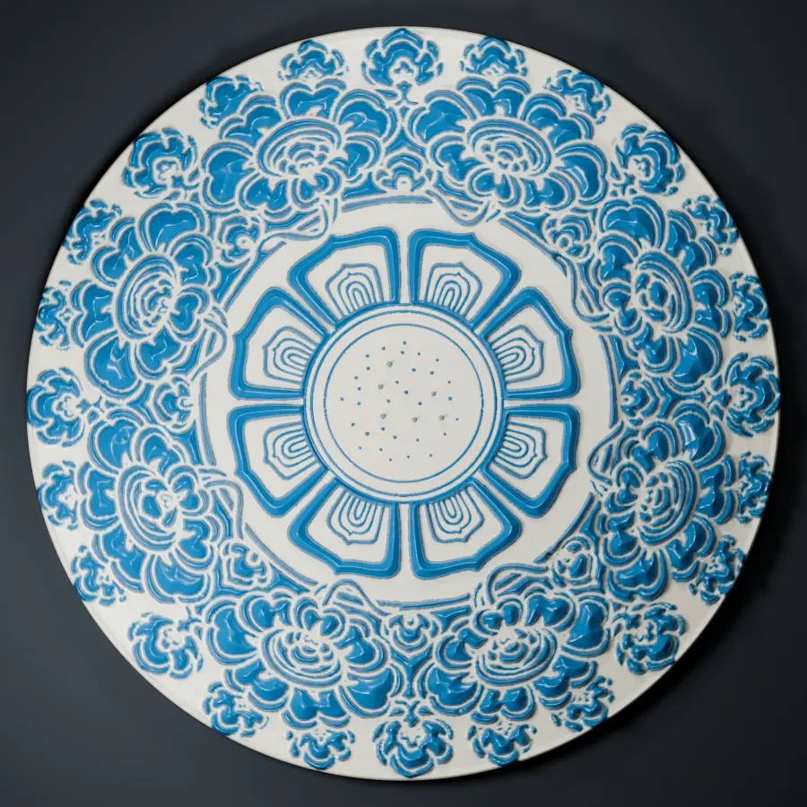
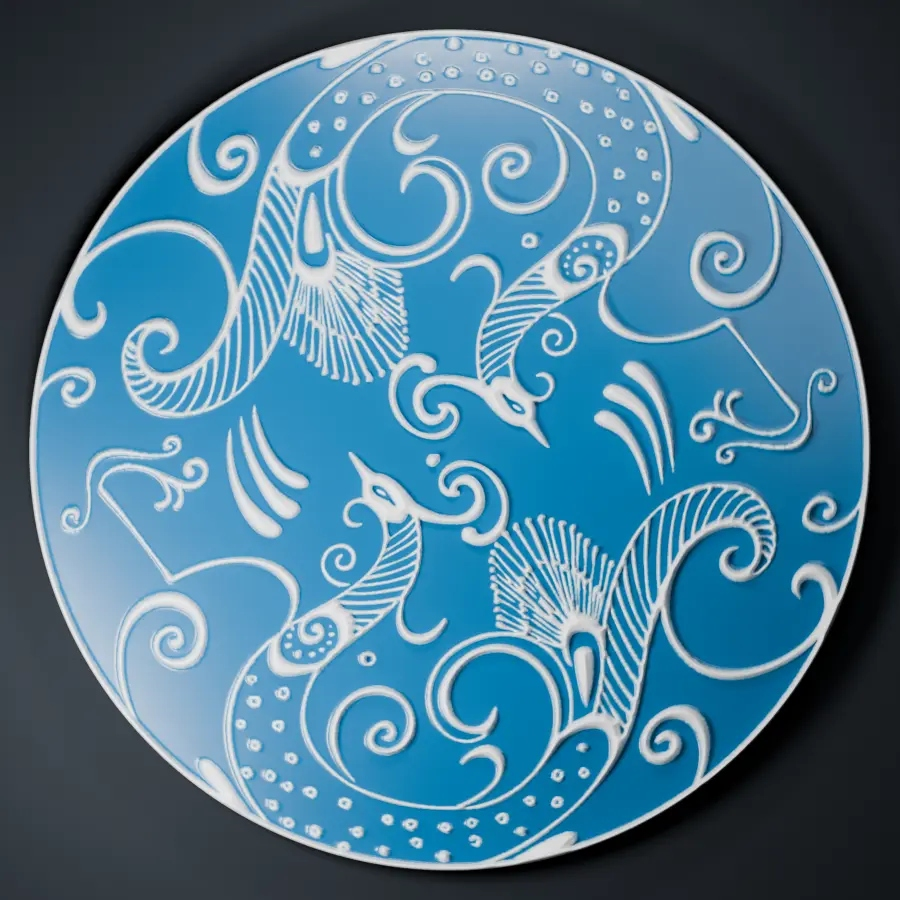
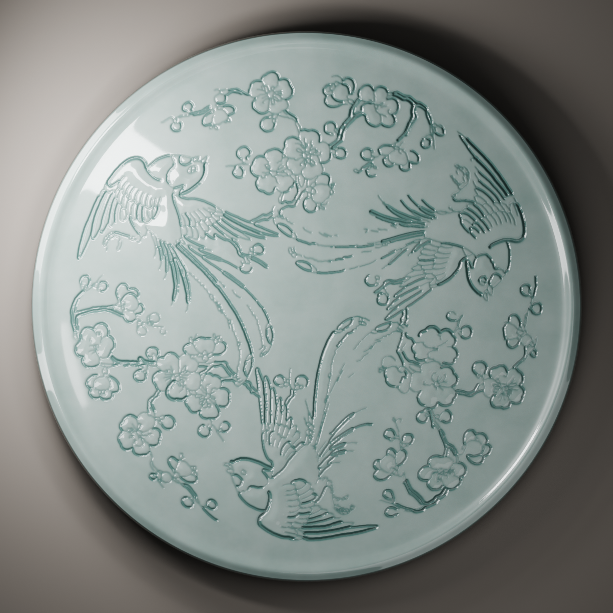

# OrnamentForge

> 面向 Codex 的复杂传统纹饰 3D 建模 Skill  
> **参考图 / 一句话描述 → 二维纹饰 → 可编辑 Blender 资产**

OrnamentForge 是「一番纸团 / PaperBall」开发的复杂纹饰数字化建模 Skill。

它不是单纯生成一张纹样图片，而是尝试把传统纹饰进一步转化为可编辑、可映射、可继续建模和二次创作的 Blender 3D 资产。

当前 V1 主要面向：

- 中国传统纹饰
- 陶瓷刻花 / 阴刻
- 浅浮雕 / 浮雕
- 彩绘陶瓷
- 连续装饰纹样
- 瓷盘、陶瓷杯、简单旋转体花瓶、平面载体等

核心工作流：

```text
参考图 / 自然语言
        ↓
二维纹饰母版
        ↓
Fidelity Reconstruction
        ↓
PlanarMaster
        ↓
SurfaceMap / Craft
        ↓
Blender 可编辑资产
```

---
## 效果展示
<table>
  <tr>
    <td align="center">
      <br/>
      <b>彩绘凤凰牡丹盘</b>
    </td>
    <td align="center">
      <br/>
      <b>蓝白莲花团花盘</b>
    </td>
  </tr>
  <tr>
    <td align="center">
      <br/>
      <b>凤凰线性浮雕盘</b>
    </td>
    <td align="center">
      <br/>
      <b>青白瓷花鸟刻花盘</b>
    </td>
  </tr>
</table>
---

# 1. 功能
## 1.1 参考图建模

如果用户已经有纹样参考图，OrnamentForge 会优先按照参考图进行重建，而不是重新设计。

流程：

```text
参考图
↓
Fidelity Reconstruction
↓
PlanarMaster
↓
SurfaceMap / Craft
↓
Blender
```

主要尽量保留：

- 原始花型
- 主体位置
- 比例关系
- 整体构图
- 线条结构
- 主次层级
- 彩色参考图中的主要颜色关系
- 来源、Hash 与 Provenance

适合：

- 黑白线稿
- 彩色传统纹样
- 花鸟纹样
- 几何纹样
- 陶瓷装饰参考图
- 刻花参考图
- 浮雕参考图
- 彩绘参考图

---

## 1.2 自然语言生成建模

如果没有参考图，可以直接告诉 OrnamentForge 想做什么。

例如：

```text
帮我做一个双龙戏珠的青白瓷花瓶刻花，
双龙围绕中央宝珠，传统一些但不要太俗。
```

工作流：

```text
自然语言
↓
Codex 当前会话图像生成能力
↓
生成二维纹饰候选
↓
选择二维纹饰母版
↓
Fidelity Reconstruction
↓
PlanarMaster
↓
SurfaceMap / Craft
↓
Blender
```

这里 AI 主要负责前期纹饰设计。

后续的结构重建、曲面映射、刻花 / 浮雕 / 彩绘以及 Blender 输出，由 OrnamentForge 工作流继续完成。

如果当前 Codex 会话没有可调用的图像生成能力，会返回：

```text
AI_IMAGE_TOOL_UNAVAILABLE / HOLD
```

不会静默切换到其他纹样生成方式。

---

## 1.3 陶瓷刻花 / 阴刻

支持将线稿和装饰纹样转换为真实的浅刻 / 阴刻几何。

典型流程：

```text
Line Art
↓
Mask / Engraving Field
↓
SurfaceMap
↓
Negative Normal Displacement
↓
真实刻槽几何
```

适合：

- 高密度传统线稿
- 花鸟纹样
- 祥云
- 龙凤纹
- 羽毛
- 枝叶
- 连续装饰线纹

高密度线稿可以直接通过 Engraving Field 路线建模，不要求先把所有线条转换成完美的独立 Curve。

---

## 1.4 浮雕

支持根据参考纹样中的视觉层级建立不同高度的浮雕结构。

例如：

```text
主体元素
→ 较高层

次级花瓣 / 叶片
→ 中层

内部纹理 / 枝线
→ 较浅层
```

支持：

- 陶瓷浅浮雕
- 分层浮雕
- 花卉纹样浮雕
- 彩色参考图转单色浮雕
- 彩绘 + 浮雕组合

---

## 1.5 彩绘陶瓷

对于彩色参考图，可以尽量保留：

- 原始花型
- 整体构图
- 元素位置
- 主要颜色关系
- 原始比例

然后将纹样映射到陶瓷表面。

适合：

- 彩绘瓷盘
- 彩绘花瓶
- 传统彩色纹样
- 彩绘 + 浮雕组合

需要注意：

> 彩绘内容可能以贴图方式保留，因此 Blender 资产可编辑，并不意味着每一个颜色区域都会自动转换成独立矢量几何。

---

## 1.6 当前支持的载体

V1 当前主要支持：

- Plane / 平面
- Cylinder / 圆柱
- Cone / 圆锥
- Simple Revolution Vase / 简单旋转体花瓶
- Plate / Shallow Bowl 的既有映射能力
- 有限 Existing UV Mesh

例如：

```text
纹样 → 瓷板
纹样 → 陶瓷杯
纹样 → 瓷盘
纹样 → 花瓶
```

SurfaceMap 会保留明确的：

- Seam
- 参数域对应关系
- Tu / Tv / Normal
- Source Correspondence
- Distortion QA

如果映射失真超过允许范围，会进入 HOLD，而不是强行交付。

---

## 1.7 青白瓷 / 影青材质

OrnamentForge 提供经过实际项目验证的陶瓷展示预设：

```text
QINGBAI_GLAZE
YINGQING_GLAZE
```

主要表现包括：

- 青白釉色
- 柔和透明釉感
- Clear Coat
- 刻槽积釉
- 青灰 / 青绿色凹槽层次
- Window Reflection
- Rim Highlight
- Grazing Light
- AgX 色彩管理

材质阶段只负责最终视觉表现，不会静默修改纹样几何。

---

# 2. 安装方式

## 环境建议

```text
Python 3.11+
Blender 4.2+
Codex
```

当前主要验证环境包括：

```text
Blender 5.1.2
```

---

## 方法一：Git Clone

在需要使用 OrnamentForge 的项目中执行：

```bash
git clone https://github.com/YifanZhiTuan/OrnamentForge.git .agents/skills/ornamentforge
```

然后在 Codex 中调用：

```text
$ornamentforge
```

---

## 方法二：下载 Release

进入：

```text
GitHub → Releases
```

下载 OrnamentForge Skill 压缩包。

解压后，Skill 根目录应直接包含：

```text
SKILL.md
agents/
references/
scripts/
```

将整个文件夹放入 Codex 可以读取的 Skill 目录即可。

---

## Python 环境

建议在 Skill 文件夹外单独创建 Python 环境。

安装依赖：

```bash
pip install -r scripts/requirements.txt
```

初始化工作目录：

```bash
python scripts/run.py --workspace <WORKSPACE> init
```

查看 CLI：

```bash
python scripts/run.py --workspace <WORKSPACE> cli --help
```

详细环境说明见：

```text
references/setup.md
```

---

# 3. 使用方式

在 Codex 中调用：

```text
$ornamentforge
```

然后像正常描述需求一样输入任务即可。

---

## 有参考图

先上传图片，然后输入：

```text
使用 $ornamentforge。

按照我上传的参考图做成陶瓷刻花。
尽量保持原来的花型、比例和构图，
不要重新设计。

最后输出 Blender 可编辑文件和成品效果图。
```

---

## 没有参考图

直接描述：

```text
使用 $ornamentforge。

帮我做一个双龙戏珠的青白瓷花瓶刻花，
双龙围着中央宝珠，
传统一点，但整体精致一些。

最后给我 Blender 可编辑文件和成品效果图。
```

OrnamentForge 会自动完成：

```text
自然语言
→ AI 二维纹饰设计
→ Fidelity
→ 建模
→ Blender
```

---

# 4. 示例提示词

## 双龙戏珠花瓶

```text
使用 $ornamentforge。

帮我做一个双龙戏珠的青白瓷花瓶刻花，
双龙围着中间的宝珠，
传统一点但不要太俗，纹样精致一些。

最后给我可编辑 Blender 文件，
再出正面、3/4 和细节图。
```

---

## 莲花团花瓷盘

```text
使用 $ornamentforge。

做一个莲花团花的青白瓷盘。

中心一朵莲花，
四周配莲叶和枝蔓，
整体对称舒服一点，不要塞得太满。

做成浅刻效果，
最后给 Blender 文件和成品图。
```

---

## 连续祥云陶瓷杯

```text
使用 $ornamentforge。

帮我做一个青白瓷杯，
杯身绕一圈连续祥云纹。

简单一些，
接缝位置不要明显。

纹样做浅刻，
最后输出 Blender 和效果图。
```

---

## 参考图刻花

```text
使用 $ornamentforge。

就按我上传的这张图做，
不要重新设计。

尽量把纹样的位置、比例和细节保留下来，
然后做成陶瓷刻花。

最后输出可编辑 Blender 文件和效果图。
```

---

## 彩色纹样转浮雕

```text
使用 $ornamentforge。

把我上传的彩色纹样做成陶瓷浮雕。

花型和整体布局不要改。

颜色可以用来帮助理解主次关系，
再把这些视觉层次转换成浮雕的高低起伏。

最后输出 Blender 可编辑文件和效果图。
```

---

## 彩绘 + 浮雕

```text
使用 $ornamentforge。

把我这张彩色纹样做成陶瓷彩绘浮雕。

保留原来的颜色、花型和布局，
同时根据纹样层次生成不同高度的浮雕。

最后输出 Blender 可编辑文件和成品图。
```

---

# 5. 当前限制

OrnamentForge V1 并不是一个：

> 输入任意一句话即可生成任意 3D 模型

的通用建模系统。

当前主要限制包括：

- 不支持任意自由曲面的自动展开
- 不提供通用 Automatic UV Unwrap
- Sphere 尚未作为正式 SurfaceMap V1 能力
- 不支持自动 Multi-chart
- 不提供复杂自动 Seam 优化
- 不提供通用全局测地线求解
- 不保证任意自由曲面花瓶都可以自动映射
- 不提供制造级模具验证
- 不预测实际陶瓷烧成结果
- 不自动判断纹样的历史年代真实性
- AI 生成纹样仍可能存在视觉错误
- 极细线稿可能出现采样锯齿或局部细节损失
- 复杂曲面映射可能触发 Distortion HOLD
- 釉面反射可能影响彩绘最终颜色观感

遇到无法可靠完成的任务时，可能返回：

```text
HOLD
```

或：

```text
NOT_SUPPORTED
```

这是 OrnamentForge 的正常质量控制行为。

Skill 不会为了强行交付而自动降低 QA 标准。

---

# 6. License

OrnamentForge 使用分离式授权。

## 代码与文档

以下内容采用：

**MIT License**

主要包括：

- Python 代码
- SKILL.md
- scripts
- 项目编写的 references
- CLI 与运行逻辑

正式许可证见：

```text
LICENSE
```

---

## 原创纹样与可复用资产

仓库内明确标记为 OrnamentForge 项目原创并允许再分发的资产采用：

**Creative Commons Attribution 4.0 International（CC BY 4.0）**

允许在遵守署名要求的前提下：

- 使用
- 修改
- 再分发
- 二次创作
- 商业使用

详细内容见：

```text
LICENSE-ASSETS.md
```

---

## 第三方依赖

第三方库继续遵循其各自的许可证。

详细内容见：

```text
THIRD_PARTY_NOTICES.md
```

---

## 不包含在本仓库授权中的内容

本仓库的开源授权不会自动覆盖：

- ArtLibrary 外部参考资料
- 第三方传统纹饰图片
- 用户上传的参考图
- AI 测试图片
- 历史运行结果
- Blender 展示成品
- 用户使用 OrnamentForge 后自行生成的作品

这些内容的版权与使用权仍由其原始来源决定。

---

# V1 已验证场景

当前 V1 已完成多组独立黑盒测试，包括：

- 双龙戏珠 → 青白瓷花瓶刻花
- 莲花团花 → 青白瓷盘刻花
- 连续祥云 → 陶瓷杯环绕浅刻
- 黑白花鸟参考图 → 陶瓷刻花
- 彩色参考图 → 彩绘陶瓷
- 彩色参考图 → 单色浮雕
- 彩色参考图 → 彩绘 + 浮雕

测试覆盖：

```text
Reference
Prompt
Fidelity
PlanarMaster
SurfaceMap
Engraved
Relief
Painted
Blender
```

---

# 当前版本

**OrnamentForge v1.0.0**

V1 当前核心只有两种用户入口：

```text
参考图
→ Fidelity
→ 3D

自然语言
→ Codex Image Design
→ Fidelity
→ 3D
```

---

# 关于项目

OrnamentForge 是「一番纸团 / PaperBall」复杂纹饰数字化方向的实验性开源项目。

它想探索的是：

> 如何让传统纹饰不只停留在一张生成图片里，而能够进一步成为可编辑、可映射、可继续创作的数字 3D 资产。

后续将根据真实使用反馈继续完善：

- Fidelity
- 曲面映射
- 刻花质量
- 浮雕结构
- 材质表现
- 更多器型适配

---

# 项目作者

**OrnamentForge** 由 **一番纸团 / PaperBall** 开发并维护。

如果你在使用过程中遇到问题、发现 Bug，或者有新的纹饰建模需求，欢迎通过 GitHub Issue 反馈。

---

## 开源说明

OrnamentForge 目前仍处于持续迭代阶段。

V1 的重点不是覆盖所有 3D 建模场景，而是先把下面两条核心路线真正跑通：

```text
参考图
→ Fidelity Reconstruction
→ 3D

自然语言
→ AI Ornament Design
→ Fidelity Reconstruction
→ 3D
```

后续版本将继续围绕：

- 更高质量的纹样还原
- 更稳定的复杂线稿处理
- 更自然的浮雕层级
- 更丰富的曲面载体
- 更真实的陶瓷材质
- 更完整的自动 QA
- 更好的 Blender 可编辑性

持续更新。

---

**Created by 一番纸团 / PaperBall**

**OrnamentForge v1.0.0**
